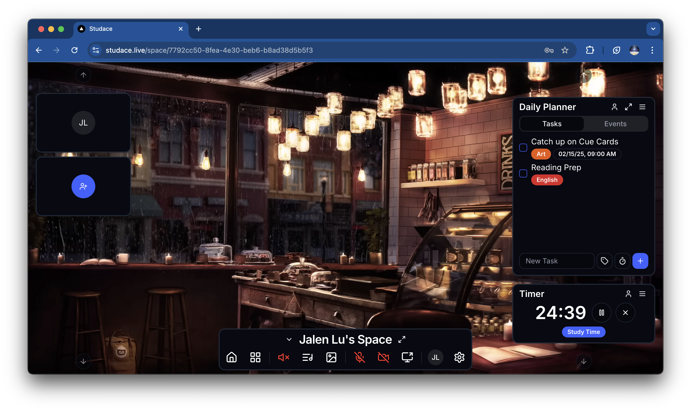

# 🎓 Studace

> Your modern personalized space for productivity, collaboration, and learning.

<div align="center">
  
## **[🚀 LAUNCH STUDACE NOW](http://137.184.243.212)**

</div>

<div align="center">
  
[](http://137.184.243.212)
[](#license)
[](#contributing)

</div>

<div align="center">


</div>



## ✨ Features

- **🎯 Personalized Dashboard** - Customize your workspace to fit your unique workflow
- **👥 Real-time Collaboration** - Work together seamlessly with team members
- **📚 Smart Learning Tools** - Enhance your learning experience with intelligent features
- **📱 Responsive Design** - Access your workspace from any device, anywhere
- **🔒 Secure & Private** - Your data is protected with industry-standard security

## 🚀 Quick Start

### Try It Now
**[🌐 Launch Studace](http://137.184.243.212)** - No installation required!

### Local Development

```bash
# Clone the repository
git clone https://github.com/yourusername/studace.git

# Navigate to project directory
cd studace

# Install dependencies
npm install

# Start development server
npm run dev

# Open your browser to http://localhost:3000
```

## 🛠️ Tech Stack

- **Frontend**: React.js, TypeScript, Tailwind CSS
- **Backend**: Node.js, Express
- **Database**: PostgreSQL
- **Authentication**: JWT
- **Real-time**: WebSocket
- **Deployment**: Docker, Digital Ocean

## 📖 Usage

### Getting Started
1. **Sign Up**: Create your free account at [studace.app](http://137.184.243.212)
2. **Set Up Your Space**: Customize your dashboard and preferences
3. **Invite Collaborators**: Add team members to your workspace
4. **Start Creating**: Begin organizing your projects and tasks

### Key Workflows
- **Project Management**: Create, organize, and track your projects
- **Team Collaboration**: Share documents and communicate in real-time
- **Learning Paths**: Set up structured learning journeys
- **Progress Tracking**: Monitor your productivity and learning goals

## 🎨 Screenshots

| Dashboard | Collaboration | Learning Tools |
|-----------|---------------|----------------|
|  |  |  |

## 🗺️ Roadmap

- [ ] Mobile App (iOS/Android)
- [ ] Advanced Analytics Dashboard
- [ ] Third-party Integrations (Google Workspace, Slack)
- [ ] AI-Powered Study Recommendations
- [ ] Offline Mode Support
- [ ] Advanced Permission System

## 🤝 Contributing

We love contributions! Please see our [Contributing Guide](CONTRIBUTING.md) for details.

### Development Setup
```bash
# Fork the repo and clone your fork
git clone https://github.com/yourusername/studace.git

# Create a new branch for your feature
git checkout -b feature/amazing-feature

# Make your changes and commit
git commit -m 'Add amazing feature'

# Push to your fork and create a pull request
git push origin feature/amazing-feature
```

## 📄 License

**Proprietary Software** - All rights reserved.

Copyright (c) 2025 [Your Name/Company]. This software and associated documentation files are proprietary and confidential. Unauthorized copying, distribution, or use is strictly prohibited.

For licensing inquiries, contact: [your-email@studace.app]

## 🙏 Acknowledgments

- Thanks to all contributors who helped build Studace
- Inspired by modern productivity and learning platforms
- Built with ❤️ for students and professionals worldwide

## 📞 Support

- 🐛 **Bug Reports**: [Create an issue](https://github.com/yourusername/studace/issues)
- 💡 **Feature Requests**: [Start a discussion](https://github.com/yourusername/studace/discussions)
- 📧 **Contact**: support@studace.app
- 💬 **Community**: [Join our Discord](https://discord.gg/studace)

---

<div align="center">
  <p>Built with 🚀 by the Studace Team</p>
  <p>
    <a href="http://137.184.243.212">🌐 Live Demo</a> •
    <a href="#features">📋 Features</a> •
    <a href="#contributing">🤝 Contributing</a> •
    <a href="#support">📞 Support</a>
  </p>
</div>
