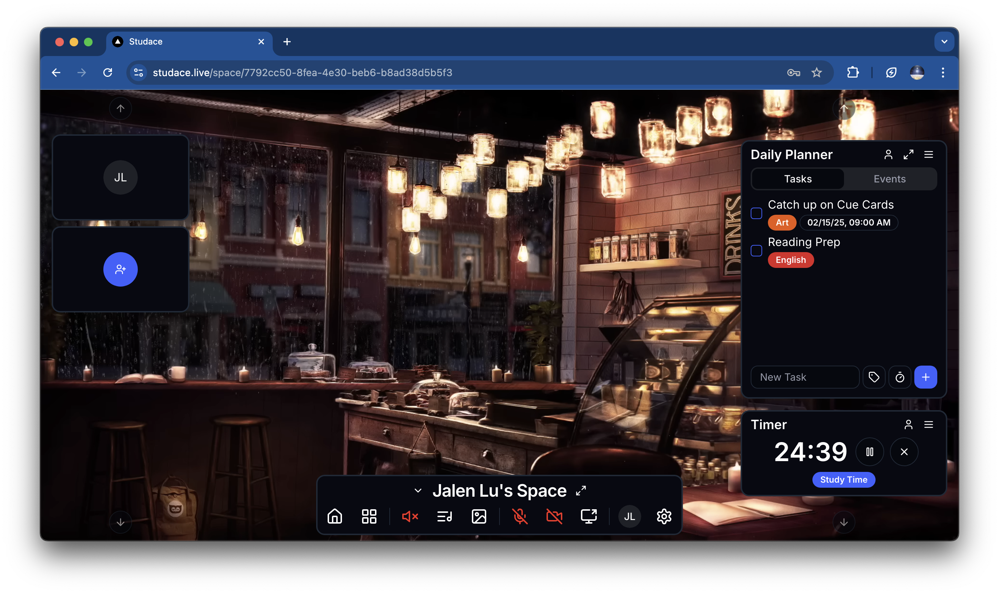

*i built this before vibe coding btw* · **Defunct:** Now part of [CMUCal](https://cal.scottylabs.org/)

# 🎓 Studace

> Your modern personalized space for productivity, collaboration, and learning.

  
## **[🚀 LAUNCH STUDACE NOW](https://www.studace.live/)**

  

## ✨ Features

- **🎯 Personalized Spaces** - Customize your space to fit your unique workflow
- **👥 Real-time Collaboration** - Work together seamlessly with team members
- **📚 Smart Learning Tools** - Enhance your learning experience with intelligent features
- **📱 Responsive Design** - Access your space from any device, anywhere
- **🔒 Secure & Private** - Your data is protected with industry-standard security

## Try It Now
**[🌐 Launch Studace](https://www.studace.live/)**

## 🛠️ Tech Stack

- **Frontend**: React.js, TypeScript, Tailwind CSS
- **Backend**: Next.js
- **Database**: PostgreSQL
- **Authentication**: JWT
- **Real-time**: WebSocket
- **Deployment**: DigitalOcean

## 📖 Usage

### Getting Started
1. **Sign Up**: Create your free account at [studace.app](https://www.studace.live/)
2. **Set Up Your Space**: Customize your dashboard and preferences
3. **Invite Collaborators**: Add team members to your space
4. **Start Creating**: Begin organizing your projects and tasks

## 🗺️ Roadmap

- [ ] Enhanced collaboration support
- [ ] Space explore & marketplace
- [ ] Third-party Integrations (Google Workspace, Slack)
- [ ] AI-Powered Study Recommendations
- [ ] Further space customization options
- [ ] School-specific collaboration

## 📄 License

**Proprietary Software** - All rights reserved.

Copyright (c) 2025 [Jalen Lu]. This software and associated documentation files are proprietary and confidential. Unauthorized copying, distribution, or use is strictly prohibited.

For licensing inquiries, contact: [jalenlu2000@icloud.com]

## 📞 Support

- 🐛 **Bug Reports**: [Create an issue](https://github.com/yourusername/studace/issues)
- 💡 **Feature Requests**: [Start a discussion](https://github.com/yourusername/studace/discussions)
- 📧 **Contact**: support@studace.live
---

  
Built with 🚀 by the Studace Team

  

    <a href="http://137.184.243.212">🌐 Live Demo</a> •
    <a href="#features">📋 Features</a> •
    <a href="#support">📞 Support</a>
  

